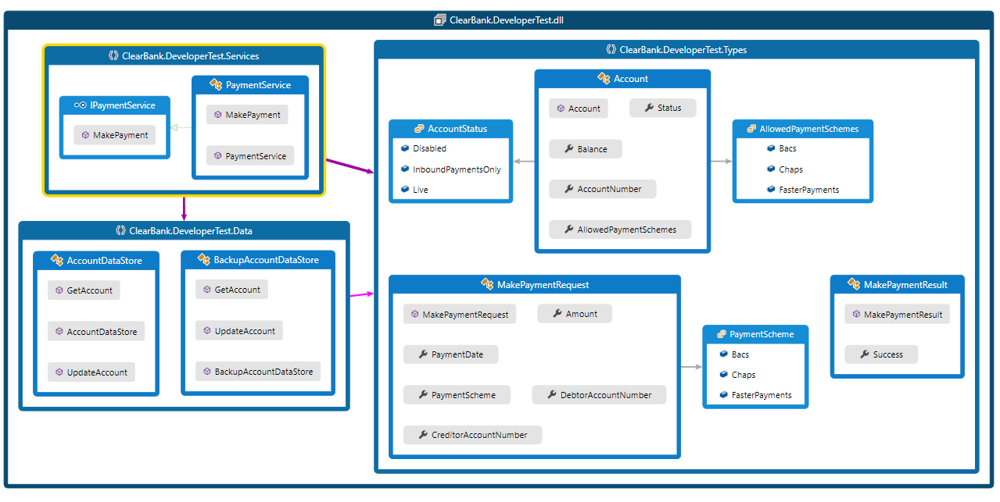

# PaymentService Demo

This is an exercise to refactor and add test cases to a 'PaymentService' demo.

Class diagram:

The steps for making a payment are:
1. Lookup the account the payment is being made from.
2. Check that the account is in a valid state to make the payment.
3. Deduct the payment amount from the account’s balance and update the account in the database.

##### Problems
Below are the common symptoms of God Object:
* SOLID Principle is not being followed and advocates for Anti-Pattern.
* Tight coupled functionalities will be difficult to maintain and enhance.
* Unit test writing will be very difficult. 
* No Divide and Conquer strategy.
* Keeping all complexities in one place.

##### Improvements
God object can be refactored and fixed. Below are the ways.
* Adherence to SOLID principals 

    `Use "Interface Segregation" principle and delegate calls to the new extracted classes.`
    `"Open to extension, closed to modification" principle, extract out each of the payments types to a separate classes and abstract processing functionality into dedicated payment types.`

* Testability

    `Write unit test for each method.`

* Readability

    `Clear and Elegant code.`
    

